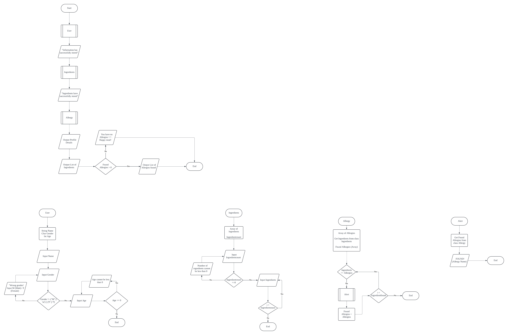

<!DOCTYPE html>
<html>

<body class="stackedit">
  
<h1 id="section-a-flowchart">Section A: Flowchart</h1>
    
    Food Allergy System is a system that will save your life by detecting potential allergens found in your immune system. The system will first ask the user for their informations, such as their Name, Gender and Age. After that, the user is required to insert the ingredients of the food that they want to check. By using these ingredients, the system will then try to match the ingredients with the potential allergens and alert the user if there is any potential allergies. After these process is done, the system will prompt all of the user information and the list of allergies found.
  </img>

<h1 id="section-b-problem-analysis">Section B: Problem Analysis</h1>

<table>
<thead>
<tr>
<th>Class</th>
<th>Attributes</th>
<th>Method</th>
</tr>
</thead>
<tbody>
<tr>
<td>User</td>
<td>-Name
 -Age
 -Gender</td>
  <td>-inputName -inputGender -inputAge </td>
        </tr>
</tr>
<td>Ingredient</td>
<td>-Array of ingredient
 -IngredientCount</td>  
  <td>-inputIngredient -countIngredient</td>
        </tr>
<tr>
<td>Allergy</td>
<td>-Array of Allergy
 -Ingredient form class Ingredient
 -Array of Status Allergy</td>
  <td>-statusAllergy</td>
        </tr>
  <tr>
<td>Alert</td>
<td>-Allergy from class Allergy</td>
  <td>-notificationAlert</td>
        </tr>

</tr>
</tbody>
</table><h1 id="section-c-class-diagram">Section C: Class Diagram</h1>

</body>

</html>
