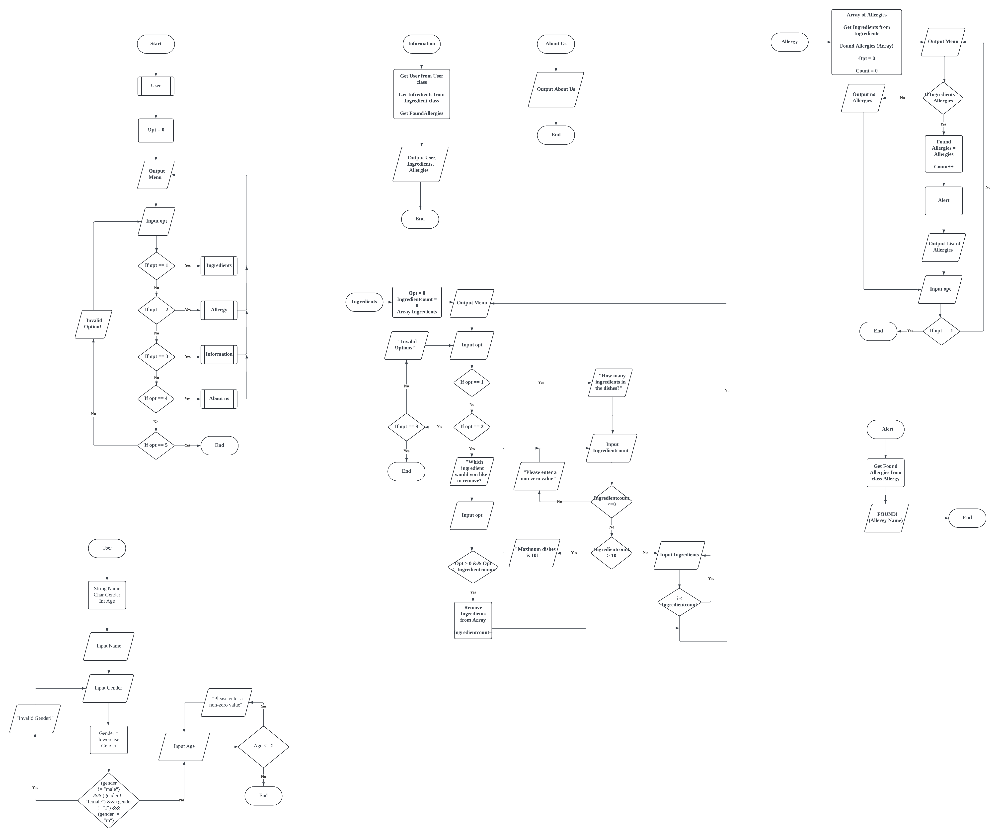

<!DOCTYPE html>
<html>
<h1 id="Final Submission">Final Submission</h1>
<body class="stackedit">
  
<h1 id="synopsis">Synopsis</h1>

The Food Allergy Alert System is designed to be an effective tool that helps users manage their food restrictions in a variety of aspects, such as kitchens, grocery shops, and homes. By providing personalized information for individuals with allergies, users can reduce their risk of allergic reactions by making smart decisions using this system. Whether it’s checking ingredients in homemade recipes, restaurant menus, or finding groceries with food labels while shopping, this system we created helps users with the knowledge and resources needed to stay safe and healthy in their daily food intake.

<h1 id="system-objectivespurpose">System Objectives/Purpose:</h1>
<ol>
<li>

Alerts and Notifications: Users can input their food allergies, and the system will generate alerts when potential allergens are detected in recipes, restaurant menus, or food labels.

</li>
<li>

Personalized Profile: Users are able to personalize their profile with specific allergies and dietary restrictions.

</li>
<li>

Recipe and Menu Analysis: The system will analyze the recipe and menus to identify potential allergens and provide different options.

</li>
</ol>
<h1 id="how-to-use-the-system">How to use the system:</h1>
<ol>
<li>

User Information: Fill the user information name and identification number.

</li>
<li>

Input Allergies: Input specific allergies.

</li>
<li>

Explore recipes and Menus: Browse through recipes and restaurant menus, with allergies information provided.

</li>
<li>

Receive Alerts: Receive alerts and notifications when potential allergic ingredients are present in recipes, menus or food labels.

</li>
</ol>

</body>

<body class="stackedit">
  
<h1 id="section-a-flowchart">Section A: Flowchart</h1>
    
<h1 id="UML Class Diagram">UML Class Diagram</h1>

<h1 id="Section B: Implementation of the Concepts :">Section B: Implementation of the Concepts :</h1>

<!DOCTYPE html>
<html>

<body class="stackedit">
  
<h1 id="encapsulation">Encapsulation</h1>
<ol>
<li>User Class</li>
</ol>

Attributes: name

Methods: inputName(), getName(), inputDetails(), returnGender(), returnAge()

<ol start="2">
<li>Ingredient Class:</li>
</ol>

Attributes: Array of ingredients, count

Methods: inputIngredient(), removeIngredient(), setCount(), getCount(), getIngredients()

<ol start="3">
<li>Allergy Class:</li>
</ol>

Attributes: Array of Found, ingredients, count

Methods: statusAllergy(), getFound(), getCounts()

<ol start="4">
<li>Alert Class:</li>
</ol>

Attributes: allergy

Methods: notificationAlert()

<ol start="5">
<li>Male Class (inherits from User):</li>
</ol>

Attributes: Age, Gender

Methods: inputAge(), inputDetails(), returnGender(), returnAge()

<ol start="6">
<li>Female Class (inherits from User):</li>
</ol>

Attributes: Age, Gender

Methods: inputAge(), inputDetails(), returnGender(), returnAge()

<h1 id="aggregation">Aggregation</h1>
<ul>
<li>The Allergy class contains one or more Ingredient instances, as indicated by a hollow diamond. The Ingredient can exist independently of Allergy.</li>
</ul>
<h1 id="inheritance">Inheritance</h1>
<ul>
<li>The male and female classes inherit attributes and methods from the User superclass, which can access private.</li>
</ul>
<h1 id="composition">Composition</h1>
<ul>
<li>The Alert class has a composition relationship with the Allergy class, indicated by a filled diamond. Alert is integral to Allergy and cannot exist independently.</li>
</ul>
<h1 id="polymorphism">Polymorphism</h1>
<ul>
<li>The User class defines a method displayDetails, which is overridden by the male and female subclasses. This allows each subclass to provide its own implementation of displayDetails, demonstrating polymorphism.</li>
<li></li>
</ul>
<h1 id="array-of-objects">Array of Objects</h1>
<ul>
<li>The class Ingredient manages an array of up to 10 strings (ingredient) to store ingredient names, with methods to set and get the count of ingredients, input new ingredients, and remove existing ones. The User class serves as a base class for Male and Female subclasses, which add age and gender-specific methods and data. The Allergy class checks the ingredients against a list of allergens from a file, storing found allergens in an array Found. Lastly, the Alert class uses an Allergy object to check for allergens and print a notification if any are found. Each class interacts through arrays of objects, such as the ingredients array in Ingredient and the Found array in Allergy, demonstrating the use of arrays to manage collections of related objects and data within the program.</li>
</ul>

</body>

</html>

</html>

