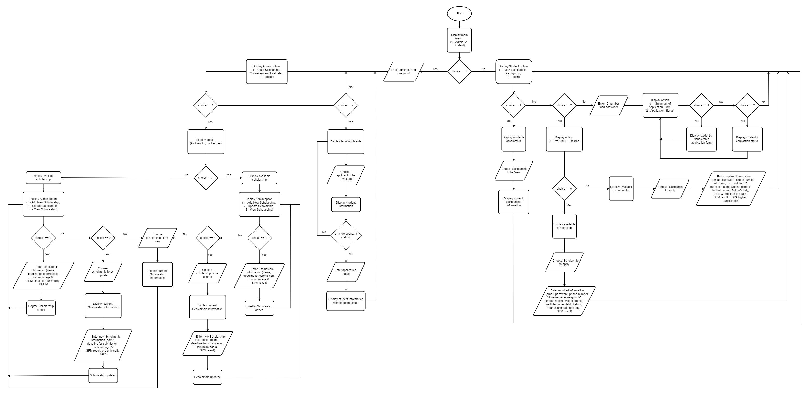

# Section A: Flowchart
The flowchart outlines a comprehensive process for the Scholarship Application system, detailing paths for both admin and student users. The process starts by identifying whether the user is an admin or a student. For Admin, they need to input their admin ID and password first. Then, they will be able to choose either to set up a scholarship, review and evaluate students, or proceed to logout the system. To set up the scholarship, Admins need to choose between Pre-University or Degree scholarship. The system will display available scholarships with the option to add, update or view scholarships. In order to add a new scholarship, they must provide the scholarship's name, date for submission, minimum age, and minimum A's for the SPM examination. Additional details are available for the Degree Scholarship, which requires a minimum pre-university CGPA. The second option involves updating the scholarship information, with the Admins selecting which scholarships to update. After that, the system will show the most recent scholarship details, and Admins can proceed to edit the scholarship's details. Admins can select option 3 to view a list of scholarships that has been stored with the details. Back to Admin menu, option 2 is Review and Evaluate option where Admin can see the list of applicants, see their details and update their application status. Then, Admin can choose option 3 to log out from the system.

Under the Student menu, they will have three options available to them which are view scholarship, sign up for new applicants, and login for existing applicants. If they want to view scholarships, the available scholarships will be shown, and they can select any one to view further information about it. For signing up, they must first select whether they are pre-university or degree students. Next, they have to enter all the necessary data, including their email address, password, phone number, complete name, race, religion, IC number, height, weight, gender, name of institute, field of study, start and end dates of their studies, and SPM results. Students pursuing degrees must additionally indicate their highest qualifying CGPA. Applicants who are already registered can choose option 3, which involves providing their password and IC number to log into the system. The system will show three further options: summary of application form, application status, and logout. They can view the application form summary with all of their details for option 1. They could choose option 2 to view the status of the application. Finally, they can select the third option to log out of the system.

# Section B: Problem Analysis
Classes and Objects 
A couple of principles from Programming Technique II—Inheritance and association (Aggregation and Composition)—were introduced to us in class and are used in our scholarship application system. Hierarchical classifications are made possible by inheritance, which is an "is-a" relationship in which one class (child/subclass) inherits properties and methods from another class (parent/superclass). Associations also use their objects to show links between classes. There are two kinds of associations: Aggregations is the first one. Aggregations represent a "has-a" connection in which a class exists independently of the total while remaining a component of another class. This suggests that a component can exist apart from the whole. The other option is Composition. Composition is a strong type of connection with stringent dependencies. This signifies that the contained object (part) does not exist without the container object (total). If the container is destroyed, so are the contained objects.

Inheritance

The emphasis of the SCHOLARSHIP APPLICATION SYSTEM is on scholarship and academic background. For this reason, we implemented Scholarship (superclass) with UGscholarship (subclass) and AcademicBG (superclass) with UGacadBG (subclass) through an inheritance relationship. An enhanced version of the AcademicBG class is the UGacadBG class. In addition to adding unique qualities (highestQuali and CGPA) pertinent to undergraduate academic background, it inherits AcademicBG's methods and attributes. This link indicates that AcademicBG is more generalized than UGacadBG. Regarding the scholarship and UGscholarship classes, The UGscholarship class extends the Scholarship class by adding the minPreUniCGPA attribute, which is specific to undergraduate scholarships. This suggests that the UGscholarship is an enhanced iteration of the Scholarship, incorporating its attributes while incorporating additional precise standards.

Code :

class UGacadBG: public academicBG {
};

class UGscholarship: public scholarship {
};

Association

The SCHOLARSHIP APPLICATION SYSTEM also focuses on the Applicant's Academic Background thus the reason we implemented Applicant with an association relationship aggregation type with academic background (academicBG) class. The academicBG class contains an attribute app which is a reference to an Applicant object. This indicates that AcademicBG has an Applicant, but the Applicant can exist independently of AcademicBG. For example, an applicant can exist and later be associated with multiple academic backgrounds. This independence qualifies it as an aggregation relationship.

This system also focused on Applicant’s Status so we use a composition relationship between Applicant and Status. For this concept, the Classes involved are ‘status’ and ‘applicant’. The Applicant class and the Status class are closely related in this relationship. Every applicant has a status, and without an applicant relationship, the status object cannot function as intended. If an Applicant object is deleted, its corresponding Status should also be deleted, signifying a composition relationship.

Aggregation code : 
class academicBG {
protected: 
applicant *app;
};

Composition code : 
class Applicant {
	protected : 
	Status s;
};

# Section C: Class Diagram

