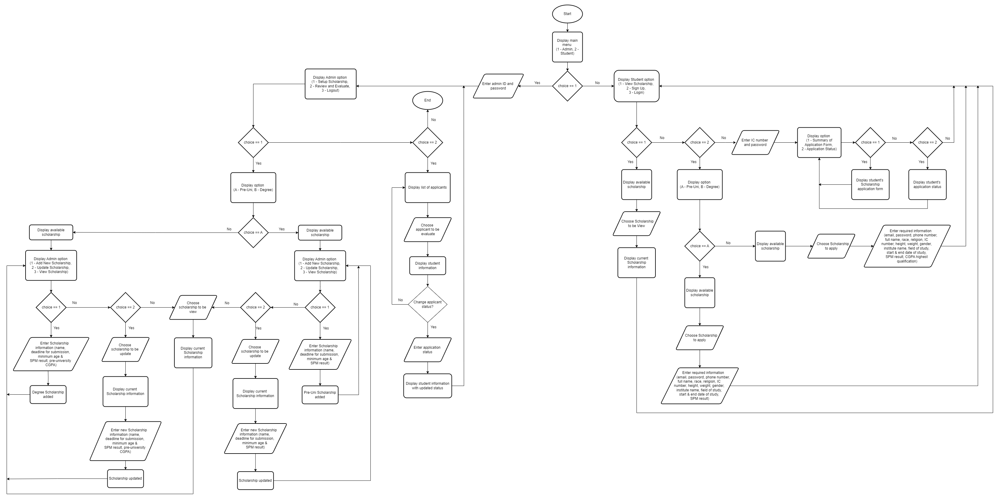
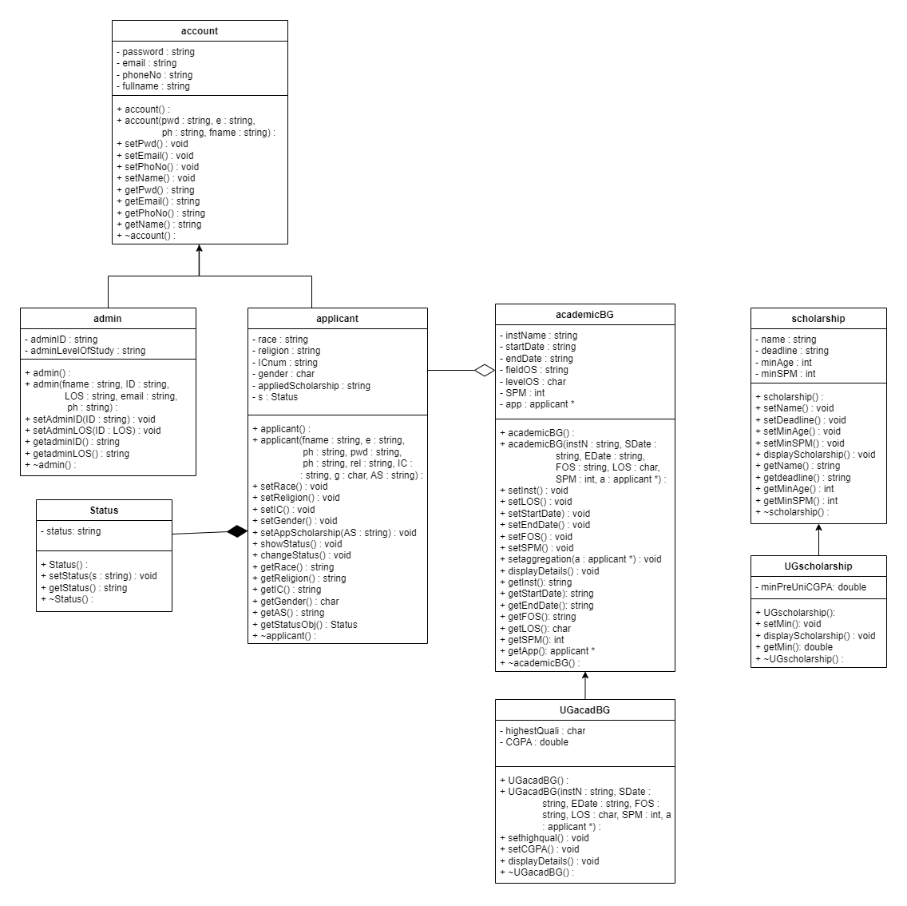

# PROJECT REPORT GROUP 7
## TOPIC: Scholarship Application System 🎓

### Table of Contents
- [1.0 Introduction]
- [2.0 Objectives of The System]
- [3.0 Analysis and Design]
- [4.0 Implementation of The Concept]
- [5.0 Conclusion]
  
 ## 1.0 INTRODUCTION

In the current era of globalization, There is a lot of people who want to apply for scholarships, especially for teenagers. Hence, we created the “Scholarship Application” system using C++. The Scholarship application system offers a platform where students can easily access scholarship information, submit applications, track status, and receive the offer. It's a user-friendly system that simplifies the application process, making it accessible to a wide range of applicants.The application offers a dependable, and user-friendly interface for managing different tasks in order to guarantee flexibility and convenience of use by utilizing the capabilities of object-oriented programming principles in C++. 

## 2.0 OBJECTIVES OF THE SYSTEM

- Make it easy for students to apply for the scholarship
- Save time and effort for both applicants and administrators with a simple, automated process
- Clearly explain the requirements, process, and timelines to applicants
- Store all applications securely in one place

## 3.0 ANALYSIS AND DESIGN

1. Flowchart

   
3. UML Class Diagram

## 4.0 IMPLEMENTATION OF THE CONCEPT

1. Encapsulation

Encapsulation combines the methods and attributes into a single unit, hiding the implementation details from the user of the object. This idea restricts direct access to specific object components, limiting unintended changes to the data.

Justification: 
The Status class encapsulates data members with private specifiers and provides public methods for accessing and modifying them. Meanwhile, the Account class encapsulates the data members using protected specifiers, allowing its derived class to access its data members.

2. Aggregation

Aggregation is a specific type of association that signifies a one-way relationship. In this relationship, the child can exist independently of the parent, representing a "has-a" relationship. It is implemented by having objects contain pointers to other objects.

Justification:
The academicBG class contains an attribute app which is a reference to an Applicant object. This indicates that AcademicBG has an Applicant, but the Applicant can exist independently of AcademicBG. For example, an applicant can exist and later be associated with multiple academic backgrounds. This independence qualifies it as an aggregation relationship.

3. Composition

Composition is a design principle in object-oriented programming where a class is composed of one or more objects from other classes, establishing a "part-of" relationship. In composition, the enclosing and enclosed objects are heavily dependent upon one another, resulting in a constrained form of aggregation. Child objects are destroyed together with their parents. The nested objects implement composition.

Justification:
The Applicant class and the Status class are closely related in this relationship. Every applicant has a status, and without a composition relationship with the Applicant class, the status object cannot function as intended. If an Applicant object is deleted, its corresponding Status should also be deleted, signifying a composition relationship.

4. Inheritance

One technique to generate a new class from an existing class is through inheritance. The new class is an advanced variant of the current one. A derived class can inherit properties and methods from the base class through inheritance.

Justification:
We implemented Account (superclass) with Admin and Applicant (subclass), Scholarship (superclass) with UGscholarship (subclass), AcademicBG (superclass) with UGacadBG (subclass) through an inheritance relationship. The superclass extends the class functionality by adding more attributes which are more specific to the subclass.This shown by the scope resolution operator( :: ).

- Base Class: Account

  Derived Class: Admin and Applicant 

- Base Class: AcademicBG

  Derived Class: UGAcadBG 

- Base Class: Scholarship

  Derived Class: UGScholarship
  

5. Polymorphism

Polymorphism refers to the ability of objects to perform the same actions in different manners. This feature allows methods to execute diverse tasks depending on the specific object they are working with, usually by means of method overriding or implementing interfaces.

Justification:
The UGacadBG class inherits from AcademicBG and overrides the displayDetails method to provide additional functionality. The overridden method calls the base class's displayDetails method using academicBG::displayDetails() to display the common details first. It then adds specific information related to UGacadBG, such as the highest qualification and CGPA. The polymorphic behavior allows the UGacadBG class to extend or modify the display details while still maintaining the base functionality defined in academicBG.

6. Array of objects
   
An array of objects is a collection that contains instances of a class or type. It allows you to store several items of the same kind in a single data structure, making them easy to retrieve and manipulate using their indices.

Justification:
For the array of objects, dynamic memory allocation (DMA) is utilized to create arrays of objects for different classes, providing flexibility in memory management. Arrays are created for scholarship, UGscholarship, applicant, academicBG, and UGacadBG classes. Each array is allocated memory at runtime using the new operator, allowing for adjustable sizes based on the application's needs. Tracking variables, such as capacity and current, are maintained for each array to monitor their respective capacities and the number of objects currently stored. This method ensures efficient memory usage and accommodates varying requirements dynamically.

## 5.0 Summary
 
In summary, all parties involved will find the process more efficient and transparent thanks to the Scholarship Application System. It makes things easier administratively, minimizes mistakes and enhances the overall experience for both applicants and administrators.
	
We can add a lot of functionality to our system using OOP, which will save admin and applicants a great deal of time and make the system easier to grasp. Additionally, our system gives candidates a comprehensive explanation of the requirements, procedures, and deadlines. Additionally, this framework guarantees that future improvements will be possible if necessary.

We owe a huge debt of gratitude to Dr. Lizawati for her direction and help during the program's development. This initiative improves our capacity to design systems and is very valuable for the future.
