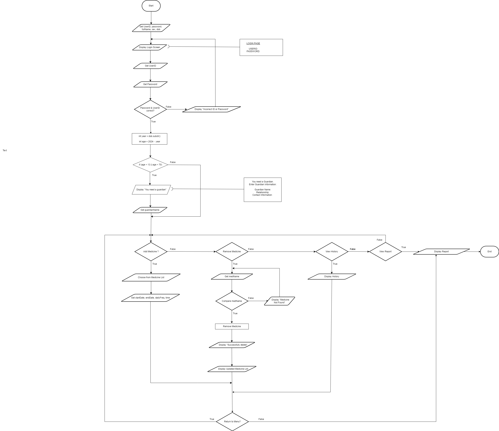
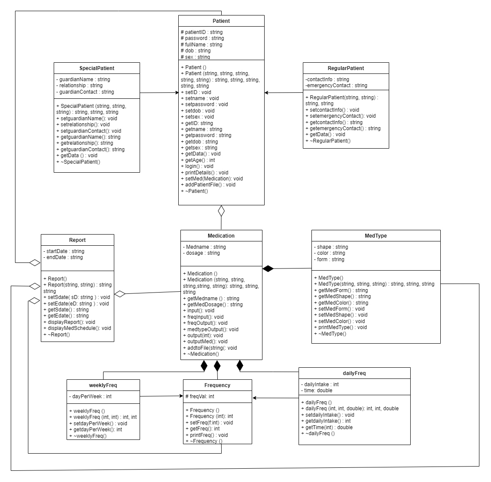

# 1.0  Section A :  Project description & Analysis and design
Our proposed system is the medication scheduler. The general idea of this system is to develop a system which can be used by individuals who have to take medication on a schedule with the accurate dosage, especially for those who have to take different medications with different dosage at a time. This is an upgraded version of the traditional system that uses labeled containers to alert patients on medicine intake. Instead, this system can be integrated into their device and can be accessed at any time.

Our system objectives are:
Medication scheduling: record prescribed medication details (medication name, shapes, color), shapes and colors are easier way to identify different medication 
Keep track: dosage, timing, routine (before meal/after meal, daily) and progress (e.g. antibiotics take up to 2 weeks only)
Reminder: Alert user the time to take medicine by send notification to make sure user take the medication on time
Secondary assurance: supervision from guardian or personal doctor especially for the elderly, guardian/personal healthcare provider can monitor patient virtually
Portable (system accessible through any electronic device: smart watch/phone): offers the convenience of having all medication information in one place

Overall, the medication scheduler system manages their medications more effectively, helping individuals with better health outcomes and improved quality of life.

On June 23, 2024, we introduced the Medication Scheduler system to Madam Lizawati, who provided encouraging input and constructive feedback. In response, we have included a number of modifications and improvements to our analytical and design process. The modifications are:
Adding database by creating output file to store patient list, patientlist.txt and patient’s medicine history, PatientName_med_history.txt
Hiding password by using getch() and include <conio.h>
Displaying the past and current medicine(s) that students have to take by using time function and include <ctime>

## 1.1 Flowchart

## 1.2 UML Class Diagram

# Section B:  Implementation of the Concepts
_Refer to Section C for the code reference._

## 2.1 Encapsulation
As proven in code provided in Section C, all data created are encapsulated within classes, with private, protected attributes and public accessor or mutator methods controlling access. It illustrates the use of bundling data and methods that operate on that data within a single class while still restricting access to some of the attributes. For instance, in the ‘Patient’ class, data members such as ‘password’ and ‘fullname’ are both marked as protected. This allows them to be accessed within the class itself and by derived class, if any, but more importantly not by any outside code. This concept guarantees that any sensitive information is guarded and can only be modified through the methods included in the public section such as ‘setpassword’ and ‘setname’. Though, this makes it easy to access the attributes as few assessors have also been included like ‘getpassword’ resulting in more controlled and secure data retrieval. All classes are provided with constructors for smooth initialization and also destructors for clean-up objects. All in all, encapsulation applied in this code helps to maintain secure data by controlling how each data is accessed and modified. 

## 2.2 Composition
Composition refers to the enclosing object and enclosed object are highly dependent on each other. The existence of the enclosed objects are determined by the enclosing objects. In our system, we applied the concept of composition where class Medication is the enclosing object, objects of class Medtype, class Frequency, class dailyFreq and weeklyFreq are enclosed objects.
This means that Medication has Medtype, Frequency, dailyFreq and weeklyFreq. Hence, once the enclosing object in Medication class is destroyed, the enclosed object will be destroyed as well; if the enclosing object in Medication is created, the enclosed object will also be created.

## 2.3 Aggregation
Aggregation is a one way relationship. The difference between aggregation and composition is that aggregation of both enclosed and enclosing objects exist independently. Based on the code attached below, the object of class Report has objects in class Medication, class Patient, Class MedType and class Frequency. As the relationship between classes is independent, the destroyed objects do not affect the other objects. The relationship between objects can be broken by only disconnecting the pointer.

## 2.4 Inheritance
In the provided code included in Section C, one of the concepts of inheritance is demonstrated through ‘dailyFreq’ and ‘weeklyFreq’, both are derived from the parent class, ‘Frequency’ or also known as base class. Implementing this relationship and concept has allowed us to inherit and utilize the ‘freqVal’ function from the parent class. This not only makes the code reusable but also exhibits a clear format of hierarchical structure. Polymorphism is shown in ‘printFreq’
which is declared as virtual in the base class and overridden in both derived classes. Because of this, both derived classes can supply their own implementation of ‘printFreq’.
Another inheritance relationship created in the code is in the context of a patient management system. The ‘Patient’ class serves as the parent class, encapsulating a few attributes such as ‘patientID’, ‘fullname’ and ‘password’.Derived from this is the ‘RegularPatient’ and ‘SpecialPatient’ that automatically inherits the properties and methods of the parent class while also adding its own specific items. This concept allows the extent of functionality of the ‘Patient’ class without the need to duplicate the code. 

## 2.5 Polymorphism
Polymorphism can be applied when there’s inheritance relationships between classes. As inheritance inherits attributes and methods from another class; Polymorphism uses those methods to perform different tasks. Polymorphism refers to a function that has the same action/same name but different behavior. As referring to our code: class Patient is a parent class, the function getData() is used in parent class and child classes, hence the functions are dynamically bound by specifying the methods as virtual in parent class. The child classes override the method getData().
The concept of polymorphism is applied in class Frequency as the parent class. printFreq() function in parent class is a virtual function, allowing the function to be dynamically bound. The 2 other child classes override the method printFreq().

## 2.6 Array of Objects
Based on the code below, we’ve created a static array where variables addMed and removeMed are able to hold 20 data.
We also implemented an array of objects where we use pointers to dynamically allocate the objects.

# 3.0 Section C:  Codes
[Code](source-code)
