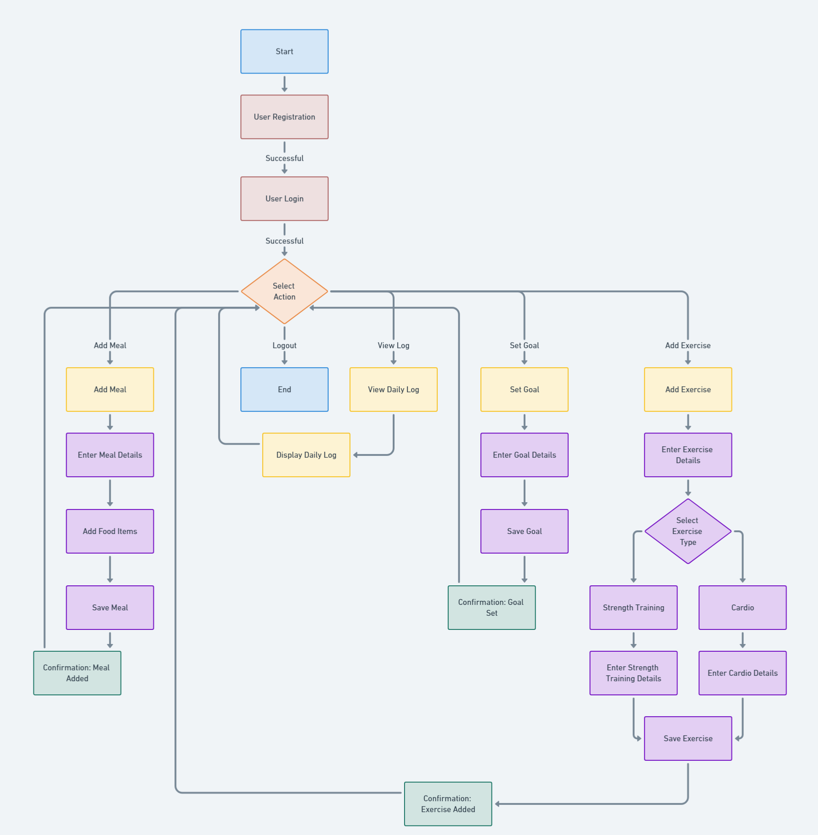

# Nutritional Tracker System 

## Problem Analysis and Design

## Section A: Flow Chart

### Flow Chart

### Analyzing the Flow Chart:

## Section B: Problem Analysis

#### Objects and Classes

### Class Relation 

## Section C: Class Diagram 

