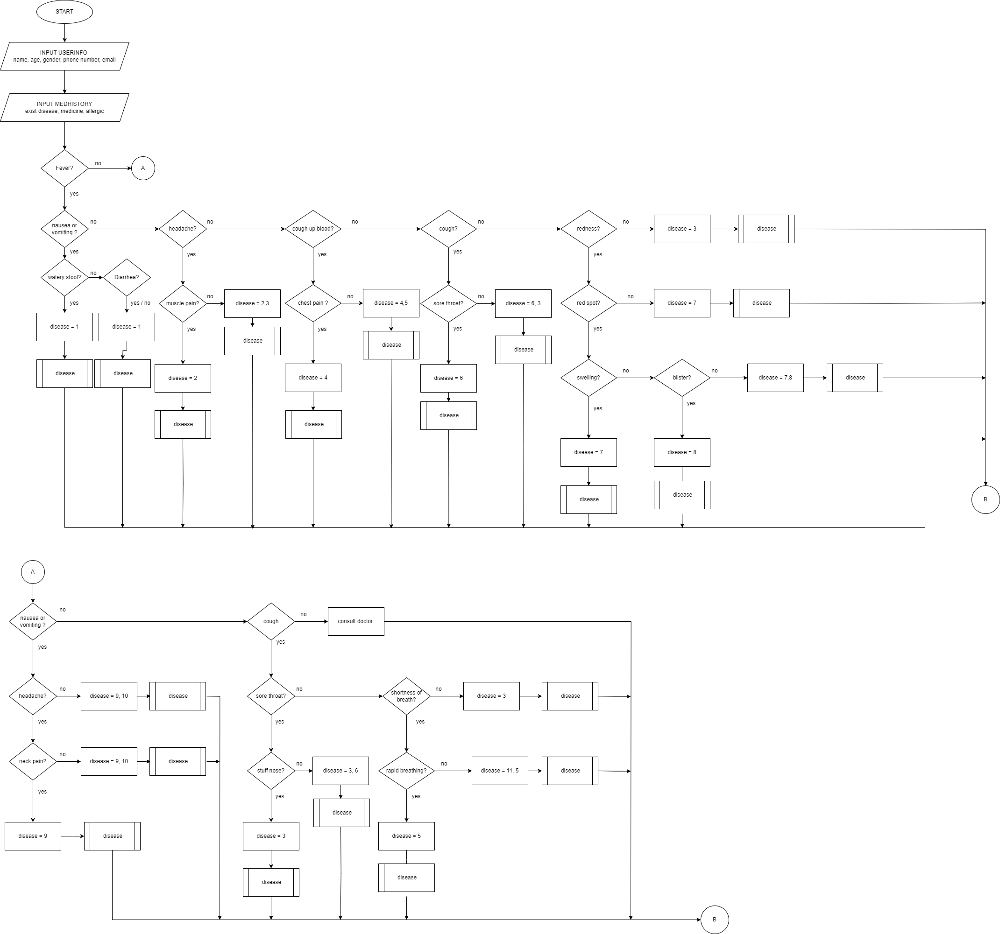
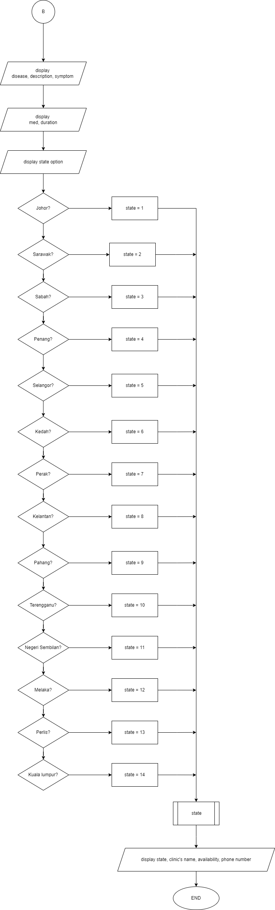
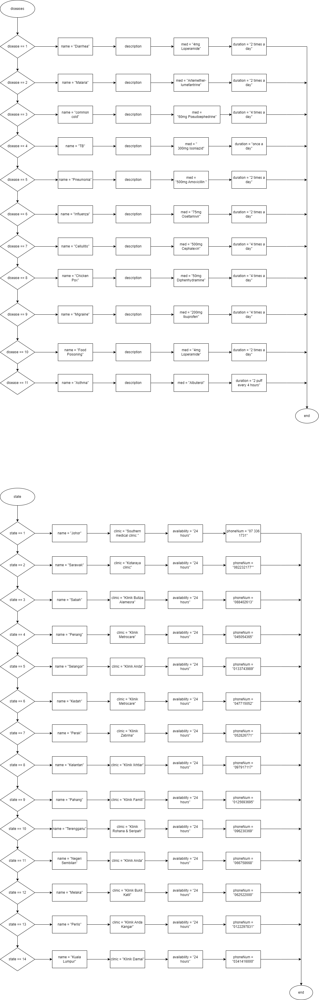
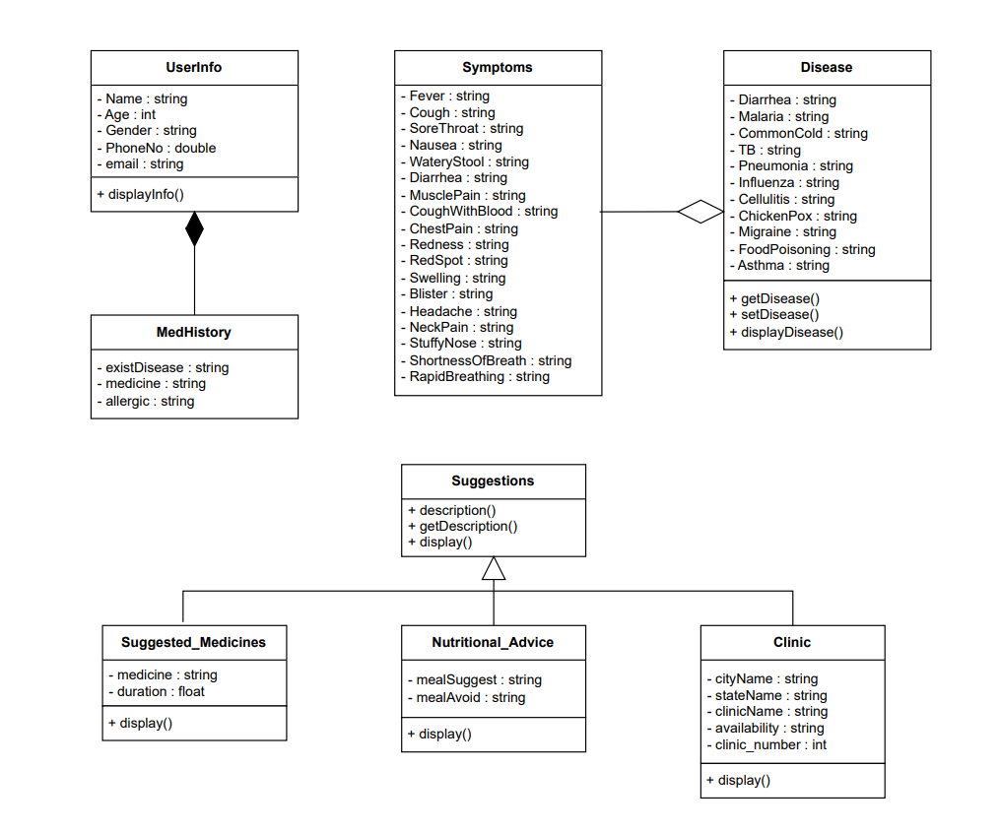

<h1 align="center"> Problem Analysis and Design </h1>
<h2>📑 Content </h2>
<ul>
  <li><a href="#flowchart"> Flow Chart </a></li>
  <li><a href="#problemanalysis"> Problem Analysis </a></li>
  <li><a href="#umlclassdiagram"> Class Diagram </a></li>
</ul>

<h2 id="flowchart">🔗 Section A (Flowchart) </h2>

The main process in the flowchart is a medical diagnosis and consultation system. It begins with the user inputting their personal information (name, age, gender, phone number, email) and medical history (existing diseases, medications, allergies). The system then evaluates the user's symptoms through a series of questions about fever, nausea, vomiting, stool consistency, headaches, muscle pain, cough, sore throat, redness, red spots, swelling, blisters, neck pain, stuffy nose, shortness of breath, and rapid breathing.

Based on the responses, the system identifies the probable diseases by matching symptoms to predefined conditions. Each disease is assigned a unique identifier (disease = 1, 2, 3, etc.) and its corresponding description, medication, and dosage are displayed. If symptoms are indicative of multiple conditions, the system lists all possible diseases. After diagnosing, the system displays medical recommendations and clinics based on the user's state location. The final output includes the disease name, description, prescribed medication, dosage, and local clinic contact information for further consultation. The process ensures the user receives both immediate guidance and local medical support information.

<h2 id="problemanalysis">🔗 Section B (Problem Analysis) </h2>

| Classes             | Attributes            | Method                  |
|---------------------|-----------------------|-------------------------|
| UserInfo            | - Name                | displayInfo()           |
|                     | - Age                 |                         |
|                     | - Gender              |                         |
|                     | - phone number        |                         |
|                     | - email               |                         |
|                     |                       |                         |
| MedHistory          | - exist disease       | addMedHistory()         |
|                     | - medicine            | displayMedHistory()     |
|                     | - allergic            |                         |
|                     |                       |                         |
| Symptoms            | - Fever               |                         |
|                     | - Cough               |                         |
|                     | - Sore Throat         |                         |
|                     | - Nausea and vomiting |                         | 
|                     | - Watery stool        |                         |
|                     | - Diarrhea            |                         |
|                     | - Muscle pain         |                         |
|                     | - Cough up blood      |                         |
|                     | - Chest pain          |                         |
|                     | - Redness             |                         |
|                     | - Red spot            |                         |
|                     | - Swelling            |                         |
|                     | - Blister             |                         |
|                     | - Headache            |                         |
|                     | - Neck pain           |                         |
|                     | - Stuffy nose         |                         |
|                     | - Shortness of breath |                         |
|                     | - Rapid breathing     |                         |
|                     |                       |                         |
| Disease             | - Diarrhea            | setDisease()            |
|                     | - Malaria             | getDisease()            |
|                     | - common cold         | displayDisease()        |
|                     | - TB                  | addDisease()            | 
|                     | - Pneumonia           |                         |
|                     | - Influenza           |                         |
|                     | - Cellulitis          |                         | 
|                     | - Chicken Pox         |                         | 
|                     | - Migraine            |                         | 
|                     | - Food Poisoning      |                         |
|                     | - Asthma              |                         | 
|                     |                       |                         |
| Suggestions         | - Suggested_Medicine  |                         |
|                     | - Nutritional_Advice  |                         |
|                     | - Clinic              |                         |
|                     |                       |                         |
| Suggested_Medicine  | - medicine            | display()               |
|                     | - duration            |                         |
|                     |                       |                         |
| Nutritional_Advice  | - mealSuggest()       | display()               |
|                     | - mealAvoid()         |                         |
|                     |                       |                         |
| Clinic              | - state               | display()               |
|                     | - stateName           |                         |
|                     | - clinicName          |                         |
|                     | - availability        |                         |
|                     | - clinic_number       |                         |

<h2 id="umlclassdiagram">🔗 Section C (UML Class Diagram) </h2>

